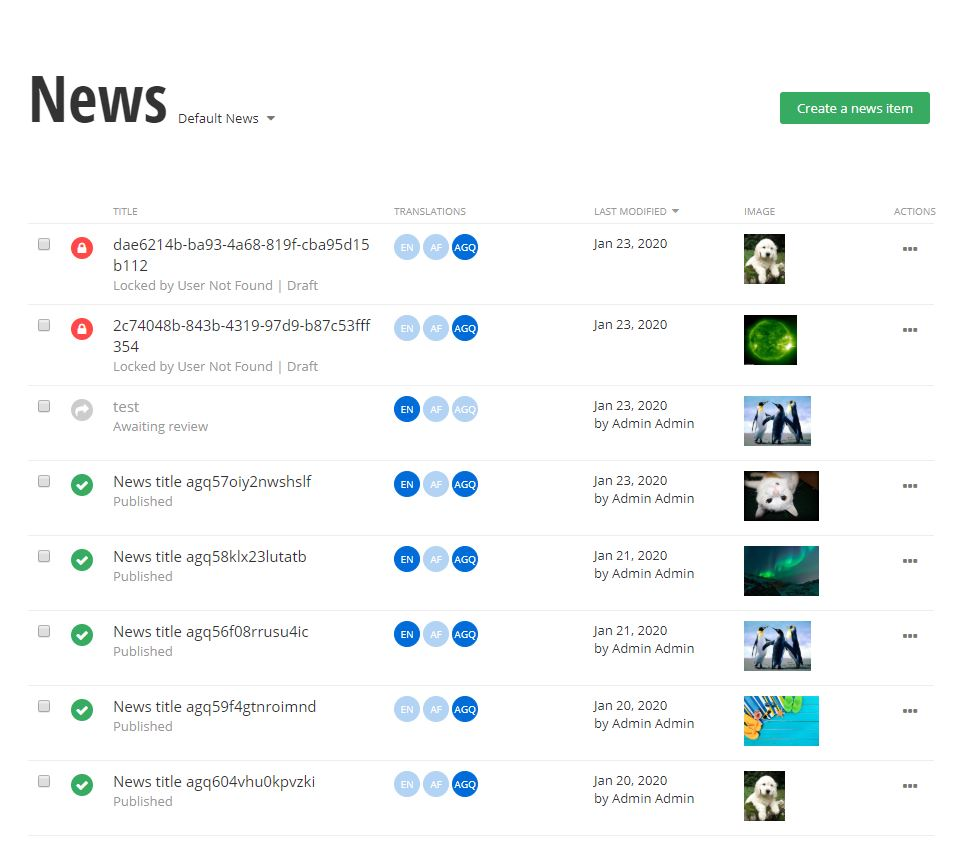

# Custom grid

You can add custom columns in the grid that show more information about the specific data item, for example related data or media, or any other kind of information, like data from external systems. What is more you can also remove some of the existing columns that bring no value to you. In order to achieve this, you have to use a specific extensibility point. A custom implementation of the [**ListColumnsProvider**](http://admin-app-extensions-docs.sitefinity.site/interfaces/listcolumnsprovider.html) interface must be provided. 

Its method [**getColumns()**](http://admin-app-extensions-docs.sitefinity.site/interfaces/listcolumnsprovider.html#getcolumns) is used to add new custom columns. The method returns an **Observable** of the [**ColumnModel**](http://admin-app-extensions-docs.sitefinity.site/interfaces/columnmodel.html) object. 

The [**ColumnModel**](http://admin-app-extensions-docs.sitefinity.site/interfaces/columnmodel.html) object has several properties. Most notable is the [**componentData**](http://admin-app-extensions-docs.sitefinity.site/interfaces/columnmodel.html#componentdata) which is a reference to the component that is displayed in the grid cell. This component should inherit the [**DataContextComponent**](http://admin-app-extensions-docs.sitefinity.site/interfaces/datacontextcomponent.html) interface which brings the [**context**](http://admin-app-extensions-docs.sitefinity.site/interfaces/datacontextcomponent.html#context) property.

Once the component is instantiated, the Admin App assigns the [**context**](http://admin-app-extensions-docs.sitefinity.site/interfaces/datacontextcomponent.html#context) property to it, that contains information for the current item, as well as all model properties you passed through using the [**ComponentData**](http://admin-app-extensions-docs.sitefinity.site/interfaces/componentdata.html#properties) interface. 

The custom component you defined is displayed in the grid cell.

The other method of the interface [**getColumnsToRemove()**](http://admin-app-extensions-docs.sitefinity.site/interfaces/listcolumnsprovider.html#getcolumnstoremove) is used to remove some of the default columns. The method returns an **Observable<string[]>** with the names of the columns to be removed.

## Arranging custom columns in the grid

You can arrange your custom columns in the grid via the [**ColumnModel's**](http://admin-app-extensions-docs.sitefinity.site/interfaces/columnmodel.html) [**ordinal?**](http://admin-app-extensions-docs.sitefinity.site/interfaces/columnmodel.html#ordinal) property. 

Prerequisite: The columns that come from Sitefinity have a some limitations
- the **Main** (usually Title) column will **always** be the first (leftmost) column with an ordinal of ` -9007199254740991` 
- the **Actions** column will **always** be the last (rightmost) column with an ordinal of `9007199254740991`
    - the **Analytics** column will **always** be right before (to the left of) the **Actions** column with an ordinal of `9007199254740990`
    - the **Sitefinity** Insights column will **always** be right before (to the left of) the **Analytics** column with an ordinal of `9007199254740989`

All other columns are spaced by `100`. For example if the columns that come from Sitefinity are: Main, Calendar, Start Date, End Date, Translations and Actions in that order, their respective ordinals will be ` -9007199254740991`, `100`, `200`, `300`, `400` and `9007199254740991`. In this case if you would like to position your custom column between the Start Date and End Date columns you would have to give your column an ordinal in the range of `201-299` inclusive.

Notes:
- If two (or more) columns have the same ordinal they will be arranged alpahbeticaly
- If a custom column is left without supplying a ordinal property it will be the last column before the system last column(s).

You may have noticed that the **Author** column is missing for all content types, and that the **DateCreated**, **LastModified** columns are missing from hierarchical content types. We have added a way for you to whitelist those columns in the AdminApp's `config.json` file:

```json
{
  "editorSettings": { 
    // omitted for brevity
  },
  "columnsSettings":{
    "columnNamesWhitelist": ["Author"],
    "hierarhicalColumnNamesWhitelist": ["DateCreated", "LastModified"]
  }
}
```

## Example

